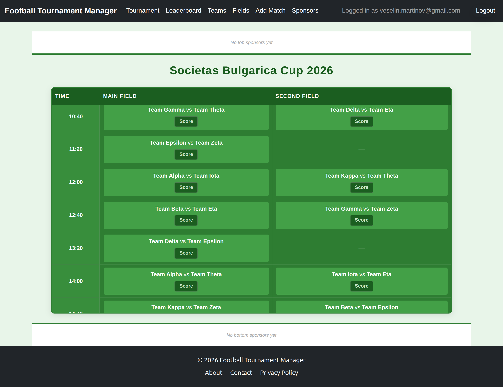
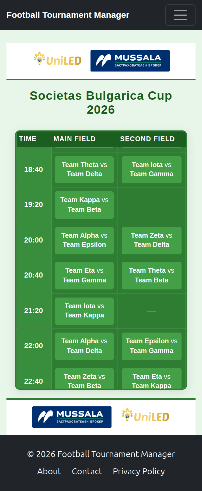
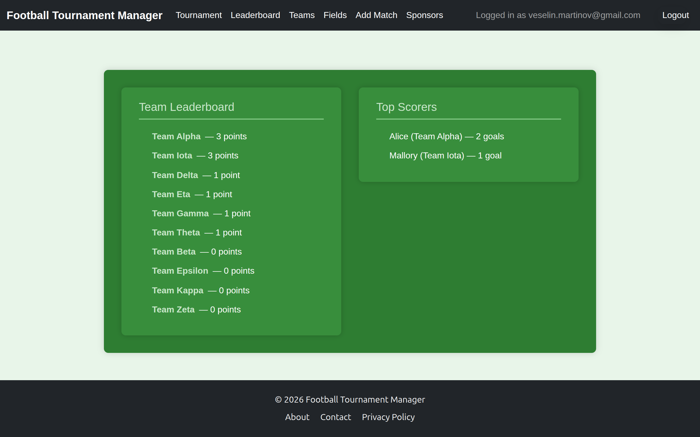

# TournamentManager

A production web application for organising and running small-scale football tournaments. Used annually by hundreds of participants at live events.

**Live:** [tournamentmanager.onrender.com](https://tournamentmanager.onrender.com)

---

## Overview

TournamentManager automates the organisational overhead of running a football tournament. Organisers create a tournament, add teams and players, generate a round-robin schedule across multiple fields, and track match results in real time. A public spectator view shows the live timetable and standings to participants without requiring login.

The project started as a solution to a real problem — an annual tournament where match results were entered manually into a spreadsheet and standings were calculated by hand after every round. TournamentManager replaced that entirely.

---

## Features

- **Tournament setup** — create a tournament, add teams and players via textarea or CSV batch upload
- **Schedule generation** — automatic round-robin schedule across multiple fields with configurable game duration and pause intervals
- **Live match tracking** — record goals, cards, own goals and substitutions per player during matches
- **Real-time standings** — leaderboard with tie-breaking by head-to-head goal difference
- **Public spectator view** — live timetable and standings accessible via a shareable slug URL, no login required
- **Sponsor banners** — upload sponsor images (auto-converted to WebP) displayed on the spectator page
- **Google OAuth** — sign in with Google alongside standard email/password registration
- **CI/CD pipeline** — GitHub Actions runs tests and deploys automatically on push to `main`

---

## Tech Stack

| Layer | Technology |
|---|---|
| Backend | Python 3.12, Django 5.2 |
| Database | PostgreSQL (psycopg3) |
| Auth | django-allauth (email + Google OAuth) |
| Storage | Azure Blob Storage (media), WhiteNoise (static) |
| Containerisation | Docker, docker-compose, nginx |
| CI/CD | GitHub Actions |
| Hosting | Render |
| Testing | pytest, pytest-django, pytest-cov |

---

## Architecture

```
accounts/          Custom user model (email-based, no username)
tournamentapp/     Core app — tournaments, teams, players, matches, events
sponsors/          Sponsor banner management with WebP image processing
```

Key design decisions:

- **Event-sourced player stats** — goals, cards and suspensions are computed from `MatchEvent` records rather than stored as counters, ensuring stats are always accurate and scoped correctly per tournament
- **Round-robin scheduler** — generates match pairings using the circle rotation algorithm, distributing matches across available fields
- **Separation of public and owner views** — the spectator page is unauthenticated; the organiser dashboard requires ownership verification on every request

---

## Local Setup

```bash
git clone https://github.com/VeselinMar/TournamentManager
cd TournamentManager
python -m venv venv
source venv/bin/activate
pip install -r requirements.txt
```

Create a `.env` file:

```
SECRET_KEY=your-secret-key
DEBUG=True
DATABASE_URL=sqlite:///db.sqlite3
ALLOWED_HOSTS=localhost,127.0.0.1
```

```bash
python manage.py migrate
python manage.py runserver
```

Or with Docker:

```bash
docker-compose up --build
```

See [DEPLOYMENT.md](DEPLOYMENT.md) for full deployment instructions including Google OAuth setup.

---

## Running Tests

```bash
pytest tests/
```

```bash
pytest tests/ --cov=tournamentapp --cov-report=html
```

The test suite covers model logic, view integration, utility functions, and schedule generation. Tests use an in-memory SQLite database — no external services required.

---

## CI/CD

Every push to `main` triggers the GitHub Actions pipeline which installs dependencies, runs the full test suite, generates a coverage report, and uploads it as an artifact.


---

## Screenshots

**Tournament timetable — organiser view**



**Public spectator view with sponsor banners**



**Leaderboard**



---

## Deployment

See [DEPLOYMENT.md](DEPLOYMENT.md) for full instructions covering Render configuration, environment variables, Google OAuth setup, and tournament day checklist.

---

## License

MIT